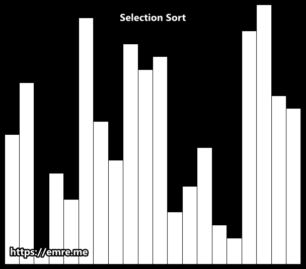

# 선택 정렬(Selection Sort)이란?

정렬되지 않은 원소 중 가장 작은 원소를 찾아 정렬된 요소의 끝에 배치한다. 따라서 정렬되지 않은 원소 중 가장 작은 요소를 지속적으로 제거하고 정렬된 원소에 추가한다. 이 과정을 목록이 완전히 정렬될 때까지 반복한다.

**매번 가장 작은 것을 선택한다**는 의미에서 **선택 정렬(Selection Sort)**이라 한다.

### GIF로 보는 선택 정렬



<br />

## 코드 구현

### 파이썬 코드

```python
def selection_sort(data):
    for i in range(len(data)):
        min_idx = i
        for j in range(i + 1, len(data)):
            if data[min_idx] > data[j]:
                min_idx = j
        data[min_idx], data[i] = data[i], data[min_idx]
    return data


data_list = [83, 21, 40, 98, 85, 24, 67, 78, 59, 65]
print(selection_sort(data_list))
# [21, 24, 40, 59, 65, 67, 78, 83, 85, 98]
```

### 자바스크립트 코드

```jsx
const selectionSort = (data) => {
  for (let i = 0; i < data.length; i++) {
    let minIdx = i;
    for (let j = i + 1; j < data.length; j++) {
      if (data[minIdx] > data[j]) minIdx = j;
    }
    [data[minIdx], data[i]] = [data[i], data[minIdx]];
  }
  return data;
};

const dataList = [83, 21, 40, 98, 85, 24, 67, 78, 59, 65];
console.log(selectionSort(dataList));
// [21, 24, 40, 59, 65, 67, 78, 83, 85, 98]
```

<br />

## 선택 정렬의 시간 복잡도

선택 정렬의 시간 복잡도는 **$O(N^2)$** 이다. 소스코드 상으로 간단한 형태의 2중 반복문이 사용되었기 때문이다.

| 최악     | 평균     | 최선     |
| -------- | -------- | -------- |
| $O(N^2)$ | $O(N^2)$ | $O(N^2)$ |

<br />

## 선택정렬의 장단점

### 장점

- 적은 개수의 원소를 정렬할 때 성능이 좋다.
- `in-place` 정렬 알고리즘이기 때문에 원소들의 개수보다 무시할만한 저장공간을 더 사용한다(추가적인 메모리 공간 사용이 적다).

### 단점

- 많은 개수의 데이터를 처리할 때 효율성(efficiency)이 떨어진다.
- 선택 정렬에는 $n$개의 요소를 정렬하기 위한 $n^2$ 단계가 필요하다.

### 참고

- [잔재미코딩](https://www.fun-coding.org/)
- [dbmspoly](http://dbmspoly.blogspot.com/p/advantage-disadvantages-of-sort.html)
- [emre.me](https://emre.me/algorithms/sorting-algorithms/)
