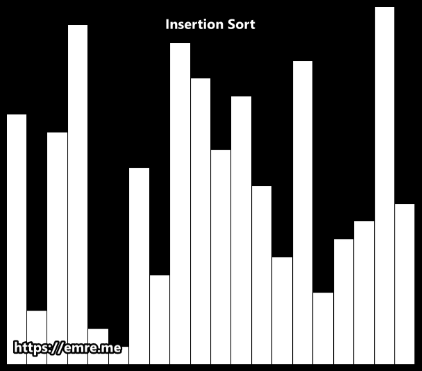

# 삽입 정렬(Insertion Sort)이란?

삽입 정렬은 특정한 데이터를 적절한 위치에 삽입한다는 의미에서 **삽입 정렬(Insertion Sort)**이라고 한다.

삽입 정렬은 필요할 때만 위치를 바꾸므로 **데이터가 거의 정렬되어 있을 때** 훨씬 효율적이다.

삽입 정렬을 2번째 원소부터 시작하여 그 앞의 원소들과 비교하여 삽입할 위치를 정한 후, 원소를 뒤로 옮기고 지정된 자리에 자료를 삽입 하여 정렬하는 알고리즘이다.

### GIF로 보는 삽입 정렬



<br />

## 코드 구현

### Python 코드

```python
def insertion_sort(data):
    for i in range(1, len(data)):
      for j in range(i - 1, 0, -1):
        if data[j] < data[j - 1]:
          data[j], data[j - 1] = data[j - 1], data[j]

  return data


data_list = [83, 21, 40, 98, 85, 24, 67, 78, 59, 65]
print(insertion_sort(data_list))
# [21, 24, 40, 59, 65, 67, 78, 83, 85, 98]
```

### JavaScript 코드

```jsx
const insertionSort = (data) => {
  for (let i = 1; i < data.length; i++) {
    for (let j = i - 1; j > 0; j--) {
      if (data[j] < data[j - 1])
        [data[j], data[j - 1]] = [data[j - 1], data[j]];
    }
  }
  return data;
};

const dataList = [83, 21, 40, 98, 85, 24, 67, 78, 59, 65];
console.log(insertionSort(dataList));
// [21, 24, 40, 59, 65, 67, 78, 83, 85, 98]
```

<br />

## 삽입 정렬의 시간 복잡도

삽입 정렬의 시간 복잡도는 **$O(N^2)$** 이다. 소스코드 상으로 간단한 형태의 2중 반복문이 사용되었기 때문이다.

| 최악     | 평균     | 최선     |
| -------- | -------- | -------- |
| $O(N^2)$ | $O(N^2)$ | $O(N^2)$ |

<br />

## 삽입정렬의 장단점

### 장점

- 알고리즘이 단순하다.
- 원소가 이미 정렬되어 있는 경우, 매우 효율적이다.
- `in-place` 정렬 알고리즘이기 때문에 공간 낭비가 적다.

### 단점

- 다른 정렬 알고리즘과 비교해 성능이 나쁘다.
- 매번 $n^2$의 과정을 수행하기 때문에 정렬해야 할 원소가 많을 경우에 알맞지 않다.
- 적은 수의 원소를 정렬할 때만 유용하다.

### 참고

- [잔재미코딩](https://www.fun-coding.org/)
- [dbmspoly](http://dbmspoly.blogspot.com/p/advantage-disadvantages-of-sort.html)
- [emre.me](https://emre.me/algorithms/sorting-algorithms/)
