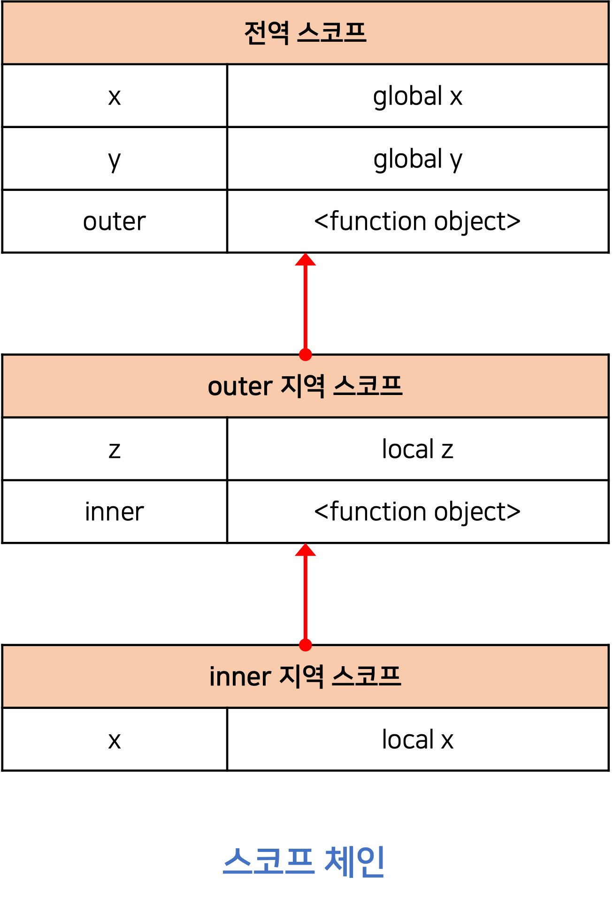

# 스코프란?

**스코프**는 **`식별자가 유효한 범위`**를 말한다.

모든 식별자(변수 이름, 함수 이름, 클래스 이름 등)는 자신이 선언된 위치에 의해 다른 코드가 식별자 자신을 참조할 수 있는 유효 범위가 결정된다.

**스코프**를 통해 식별자인 변수 이름의 충돌을 방지하여 같은 이름의 변수를 사용할 수 있게 한다. 즉, 스코프는 **`네임스페이스`**다.

```jsx
var x = "global";

function foo() {
  var x = "local";
  consol.log(x); // local
}
foo();

consol.log(x); // global
```

위 코드에서 두 개의 x 변수는 이름은 동일하지만 **스코프(자신이 유효한 범위)**가 다른 별개의 변수다.

> ✍🏻 **식별자 결정**
>
> 자바스크립트 엔진이 스코프를 통해 어떤 변수를 참조해야할 것인지 결정하는 것을 식별자 결정이라고 한다. 따라서 **스코프**를 자바스크립트 엔진이 **`식별자를 검색할 때 사용하는 규칙`**이라고도 할 수 있다.

> ✍🏻 **코드의 문맥과 환경**
>
> 코드가 어디서 실행되며 주변에 어떤 코드가 있는지를 **렉시컬 환경(lexical environment)**이라고 부른다. 즉, 코드의 문맥은 **`렉시컬 환경`**으로 이뤄진다.
> 이를 구현한 것이 **실행 컨테스트(Execution context)**이며, 모든 코드는 실행 컨텍스트에서 평가되고 실행된다.

> ✍🏻 **var 키워드로 선언한 변수의 중복 선언**
>
> **`var`** 키워드로 선언된 변수는 같은 스코프 내에서 중복 선언이 허용된다. 이는 의도치 않게 변수값이 재할당되는 부작용이 있다. 하지만 `let`이나 `const` 키워드로 선언된 변수는 같은 스코프 내에서 중복 선언을 허용하지 않는다.

<br />
<br />

# 스코프의 종류

코드는 **전역**과 **지역**으로 구분할 수 있다.

| 구분         | 설명             | 스코프      | 변수      |
| ------------ | ---------------- | ----------- | --------- |
| 전역(Global) | 코드의 가장 바깥 | 전역 스코프 | 전역 변수 |
| 지역(Local)  | 함수 몸체 내부   | 지역 스코프 | 지역 변수 |

변수는 자신이 **선언된 위치에 의해** 자신이 유효한 범위인 스코프가 결정된다. <br />
전역에서 선언된 변수는 전역 스코프를 갖는 전역 변수이고, 지역에서 선언된 변수는 지역 스코프를 갖는 지역 변수다.

## 전역과 전역 스코프

전역이란 코드의 **가장 바깥 영역**을 말한다. 전역에 변수를 선언하면 전역 스코프를 갖는 전역 변수가 된다.
**_전역 변수는 어디서든지 참조할 수 있다._**

<br />

## 지역과 지역 스코프

지역이란 **함수 몸체 내부**를 말한다. 지역에 변수를 선언하면 지역 스코프를 갖는 지역 변수가 된다.
**_지역 변수는 자신의 지역 스코프와 하위 지역 스코프에서 유효하다._**

<br />
<br />

# 스코프 체인

```jsx
var x = "global x";
var y = "global y";

function outer() {
  var z = "local z";

  function inner() {
    var x = "local x";
  }
  inner();
}
outer();
```



스코프 체인은 실행 컨텍스트의 렉시컬 환경을 단방향으로 연결한 것이다.
모든 스코프는 하나의 계층적 구조로 연결되고 모든 지역 스코프의 최상위 스코프는 전역 스코프다.
이렇게 스코프가 계층적으로 연결된 것을 스코프 체인(Scope chain)이라 한다.

변수를 참조할 때 자바스크립트 엔진은 스코프 체인을 따라 변수를 참조하는 코드의 스코프에서 시작해서 **`상위 스코프 방향`**으로 이동하며 선언된 변수를 검색한다. **_이를 통해 하위 스코프에서 상위 스코프의 변수를 참조할 수 있다._**

> ✍🏻 **렉시컬 환경(Lexical Environment)**
>
> 스코프 체인은 **실행 컨텍스트**의 **렉시컬 환경**을 **`단방향`**으로 연결한 것이다.<br /> **전역 렉시컬 환경**은 코드가 로드되면 곧바로 생성되고 **함수의 렉시컬 환경**은 함수가 호출되면 생성된다.

## 스코프 체인에 의한 변수 검색

자바스크립트 엔진은 스코프 체인을 따라 변수를 참조하는 코드의 스코프에서 시작해서 상위 스코프 방향으로 이동하며 선언된 변수를 검색한다.

**_상위 스코프에서 유효한 변수는 하위 스코프에서 자유롭게 참조할 수 있지만, 하위 스코프에서 유효한 변수를 상위 스코프에서 참조할 수 없다._**

## 스코프 체인에 의한 함수 검색

```jsx
// 전역 함수
function foo() {
  console.log("global function foo");
}

function bar() {
  // 중첩 함수
  function foo() {
    console.log("local function foo");
  }
  foo(); // local function foo
}
bar();
```

함수 선언문으로 함수를 정의하면 런타임 이전에 함수 객체가 먼저 생성된다.

함수는 식별자에 함수 객체가 할당된 것 외에는 **일반 변수와 다를 바 없다.**

<br />
<br />

# 함수 레벨 스코프

지역은 함수 몸체 내부를 말한다. 이는 **함수에 의해서만 지역 스코프가 생성된다**는 것이다.

### 블록 레벨 스코프(Block Level Scope)

대부분의 프로그래밍 언어는 함수 몸체만이 아니라 모든 코드 블록 (if, for, while, try/catch 등)이 지역 스코프를 만든다. 이러한 특성을 **블록 레벨 스코프**라 한다.

### 함수 레벨 스코프(Function Level Scope)

**var 키워드로 선언된 변수는 오로지 함수의 코드 블록(함수 몸체)만을 지역 스코프로 인정한다.** 이러한 특성을 **함수 레벨 스코프**라 한다.

**`var`** 키워드로 선언된 변수는 **함수 레벨 스코프**만을 인정하기 때문에 함수 몸체 밖에서 var 키워드로 선언한 변수는 코드 블록 내부에 있더라도 전역 변수로 취급된다.

```jsx
var x = 1;

if (true) {
  var x = 10;
}

console.log(x); // 10
```

```jsx
var i = 10;

for (var i = 0; i < 5; i++) {
  console.log(i); // 0 1 2 3 4
}

console.log(i); // 5
```

**`var`** 키워드로 선언된 변수는 함수의 코드 블록만을 지역 스코프로 인정하지만, **`let`**, **`const`** 키워드는 **블록레벨 스코프**를 지원한다.

<br />
<br />

# 렉시컬 스코프

```jsx
var x = 1;

function foo() {
  var x = 10;
  bar();
}

function bar() {
  console.log(x);
}
foo(); // 1
bar(); // 1
```

### 동적 스코프(Dynamic scope)

**_함수를 어디서 호출했는지에 따라 함수의 상위 스코프를 결정한다._** 즉, 함수를 **정의하는 시점**에 함수가 어디서 호출되는지 알 수 없다. 따라서 **함수가 호출되는 시점에 동적으로 상위 스코프를 결정한다.**

### 정적 스코프(Static scope) 또는 렉시컬 스코프(Lexical scope)

**_함수를 어디서 정의했는지에 따라 함수의 상위 스코프를 결정한다._ 함수 정의가 평가되는 시점에 상위 스코프가 정적으로 결정된다.**<br />**대부분의 프로그래밍 언어는 렉시컬 스코프를 따른다.**

자바스크립트는 렉시컬 스코프를 따르므로 함수를 어디서 호출했는지가 아니라 함수를 어디에 정의했는지에 따라 상위 스코프를 결정한다. 함수가 호출된 위치는 상위 스코프 결정에 어떠한 영향도 주지 못한다.<br />**렉시컬 스코프는 클로저와 깊은 관계가 있다.**

<br />

### 참고

- https://poiemaweb.com/
- 모던 자바스크립트 Deep Dive
